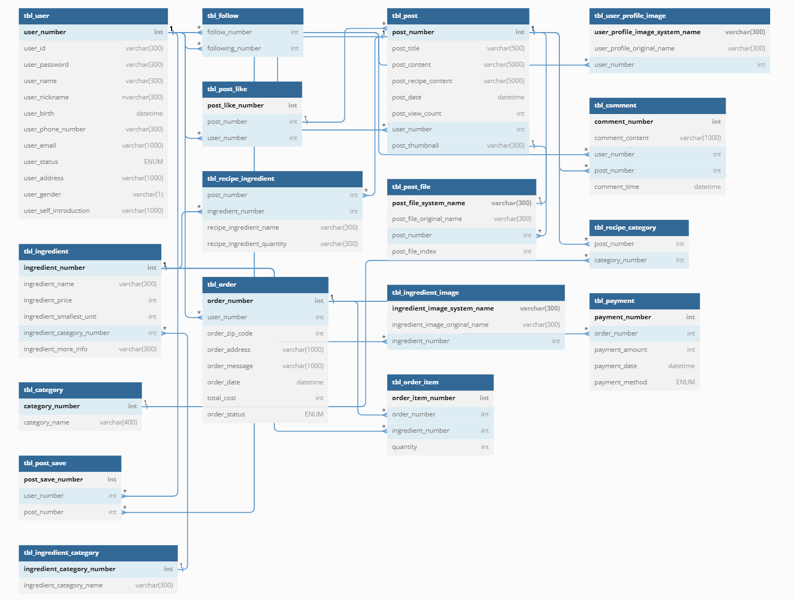

# 프로젝트 이름 : cookpang - JSP Project

## 📚프로젝트 주제 

1.   sns컨셉으로 사용자가 자신의 레시피를 공유하고 다른사람들의 레시피도 찾아 볼 수 있는 사이트
2.  레시피에 필요한 재료들을 구매 할 수 있는 사이트

## 목차
- [프로젝트 이름 : cookpang - JSP Project](#프로젝트-이름--cookpang---jsp-project)
  - [📚프로젝트 주제](#프로젝트-주제)
  - [목차](#목차)
  - [팀 구성](#팀-구성)
  - [ERD구성](#erd구성)
  - [Tools](#tools)
  - [나의 작업](#나의-작업)
    - [관리자 페이지  기능소개 WIKI로 이동](#관리자-페이지--기능소개-wiki로-이동)
    - [관리자 차트  기능소개 WIKI로 이동](#관리자-차트--기능소개-wiki로-이동)
    - [관리자 로그인  기능소개 WIKI로 이동](#관리자-로그인--기능소개-wiki로-이동)
    - [게시글 보기  기능소개 WIKI로 이동](#게시글-보기--기능소개-wiki로-이동)
    - [게시글 작성(front)  기능소개 WIKI로 이동](#게시글-작성front--기능소개-wiki로-이동)

## 팀 구성

|팀장|이동재|           
|:--:|:--:|
|**부팀장**|**김대연**|
|팀원|강승연|
|팀원|박은서|
|팀원|송지호|

## ERD구성

ERD 이미지

    

 ## Tools
- **Java**
- **JSP**
- **Eclipse**
- **Mybatis**
- **MySql**

## 나의 작업
### 관리자 페이지 <a href="https://github.com/gimdaeyeon/cookpang/wiki/%EA%B4%80%EB%A6%AC%EC%9E%90-%ED%8E%98%EC%9D%B4%EC%A7%80"> 기능소개 WIKI로 이동</a>
- 회원 관리
- 게시글 관리
- 결제 관리

### 관리자 차트 <a href="https://github.com/gimdaeyeon/cookpang/wiki/%EA%B4%80%EB%A6%AC%EC%9E%90-%EC%B0%A8%ED%8A%B8"> 기능소개 WIKI로 이동</a>
- 일 별 매출 그래프
- 카테고리별 조회 수
  

.png?type=w580)

### 관리자 로그인 <a href="https://github.com/gimdaeyeon/cookpang/tree/main"> 기능소개 WIKI로 이동</a>

 
### 게시글 보기 <a href="https://github.com/gimdaeyeon/cookpang/wiki/%EA%B2%8C%EC%8B%9C%EA%B8%80-%EB%B3%B4%EA%B8%B0"> 기능소개 WIKI로 이동</a>
- 게시글 내용
- 댓글
- 게시글 좋아요
- 게시글 저장

### 게시글 작성(front) <a href="https://github.com/gimdaeyeon/cookpang/wiki/%EA%B2%8C%EC%8B%9C%EA%B8%80-%EC%9E%91%EC%84%B1(front)"> 기능소개 WIKI로 이동</a>
- 사진 미리보기 슬라이드
- +,- 버튼으로 요소 추가
- 카테고리(체크박스 선택상태에 따라 스타일 변경)

